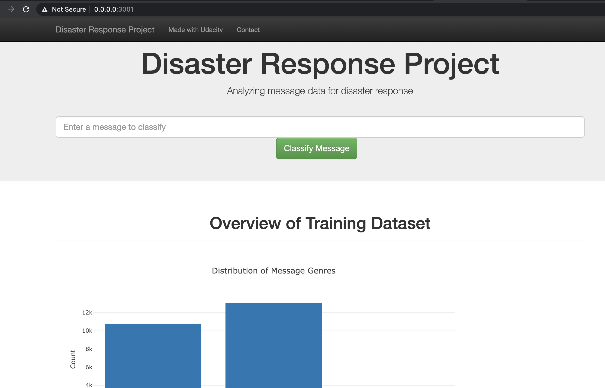
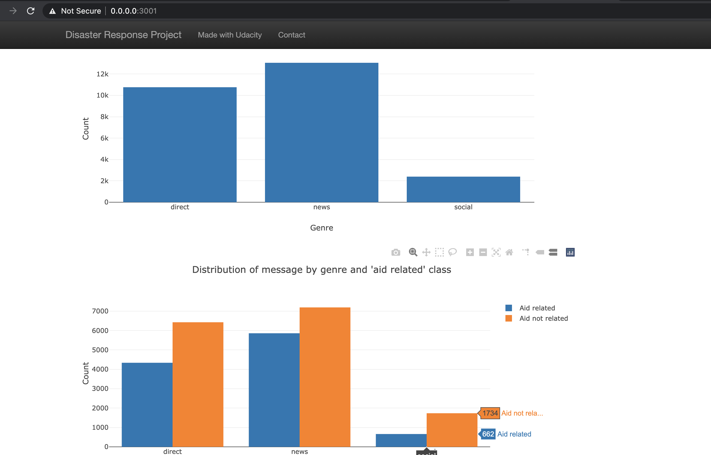
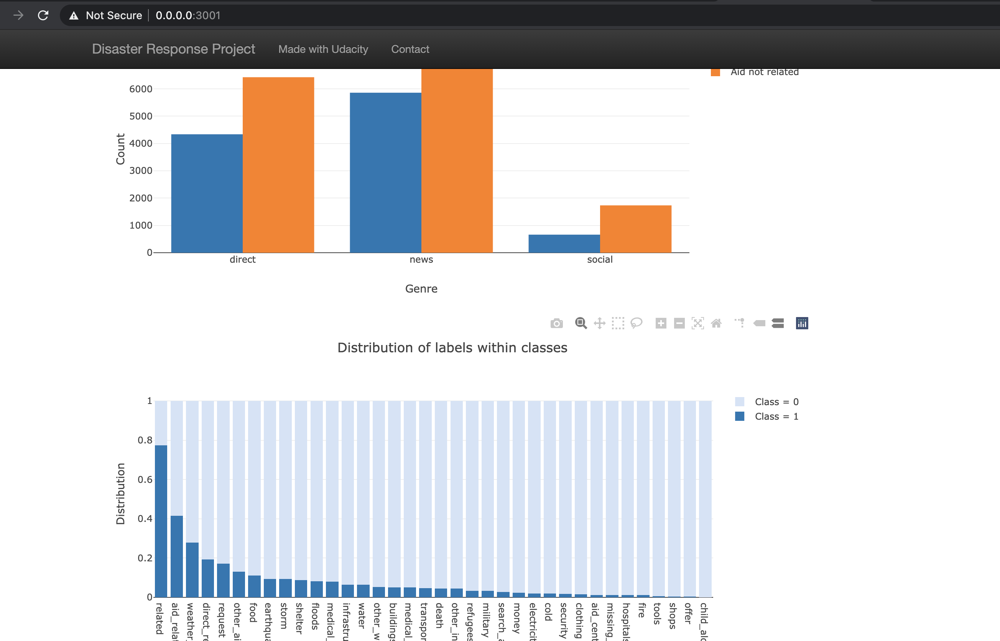

# Disaster-response-pipeline

This project was completed as part of the requirements for Udacity NanoDegree Certification

### Table of Contents
1. [Installation](#installation)
2. [Project Summary](#Summary)
3. [Data Source](#source)
4. [File Descriptions](#files)
5. [How To Run Script](#script)
5. [Results](#results)
6. [Licensing, Authors, and Acknowledgements](#licensing)

## Installation Technologies 
The required Technologies for this project include Python with some of it's libraries; Scikit Learn, Pandas, Sqlite3, sqlalchemy, nltk, plotly, pickle and HTML, Bootstrap.

## Project Summary 
The aim of this project involves building a classification model that that categorizes real messages that were sent during disaster events. This was done by creating a machine learning pipeline so that the message can be sent to the appropriate relief agency.

The project has three componants which are:

1. ETL Pipeline: process_data.py file contain the script to create ETL pipline which:
 - Loads the messages and categories datasets
 - Merges the two datasets
 - Cleans the data
 - Stores it in a SQLite database
2. ML Pipeline: train_classifier.py file contain the script to create ML pipline which:
 - Loads data from the SQLite database
 - Splits the dataset into training and test sets
 - Builds a text processing and machine learning pipeline
 - Trains and tunes a model using GridSearchCV
 - Outputs results on the test set
 - Exports the final model as a pickle file
 3.Flask Web App: the web app enables the user to enter a disaster message, and then view the categories of the message.
 - The web app also contains some visualizations that describe the data.

## Data Source 
The data was provided by [Figure Eight](https://www.figure-eight.com) in partnership with Udacity's Data Scientist Nanodegree Program and it contained labeled disaster messages received by an aid organization.

## File Descriptions 

 - README.md: read me file
 - ETL Pipeline Preparation.ipynb: contains ETL pipeline preparation code
 - ML Pipeline Preparation.ipynb: contains ML pipeline preparation code
 - DisasterResponse.db: disaster response database in sqlite3 databases
 - workspace:
    - \app:
       - run.py: flask file to run the app
       - \templates:
            - master.html: main page of the web application 
            - go.html: result web page
    - \data
        - disaster_categories.csv: categories dataset
        - disaster_messages.csv: messages dataset
        - process_data.py: ETL process
    - \models
        - train_classifier.py: classification code
        - classifier.pkl: pickle file with classifier model
        
 
## How to Run the Script 
1. Run the following commands in the project's root directory to set up your database and model.

    - To run ETL pipeline that cleans data and stores in database
        `python data/process_data.py data/disaster_messages.csv data/disaster_categories.csv data/DisasterResponse.db`
    - To run ML pipeline that trains classifier and saves
        `python models/train_classifier.py data/DisasterResponse.db models/classifier.pkl`

2. Run the following command in the app's directory to run your web app.
    `python app/run.py`

3. Go to http://0.0.0.0:3001/

## Results
Please see screenshots of Web app below.

